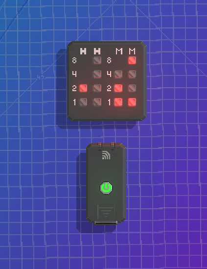

# Binary Clock

This gadget displays the current time in a binary format using LEDs. It features separate LEDs for the hour (10s and 1s) and minute (10s and 1s) digits. It also caches the IP and previous time to startup quicker.

This gadget requires internet permissions to function properly.

This gadget connects to 2 websites:
- [timeapi.io](https://timeapi.io) to get the time
- [ipify.org](https://www.ipify.org/) to get the IP for the correct time and date

Links:
- [Steam Workshop page](https://steamcommunity.com/sharedfiles/filedetails/?id=2985415535)
- [json.lua](https://github.com/rxi/json.lua)
- [Wikipedia page on binary clocks](https://en.wikipedia.org/wiki/Binary_clock)