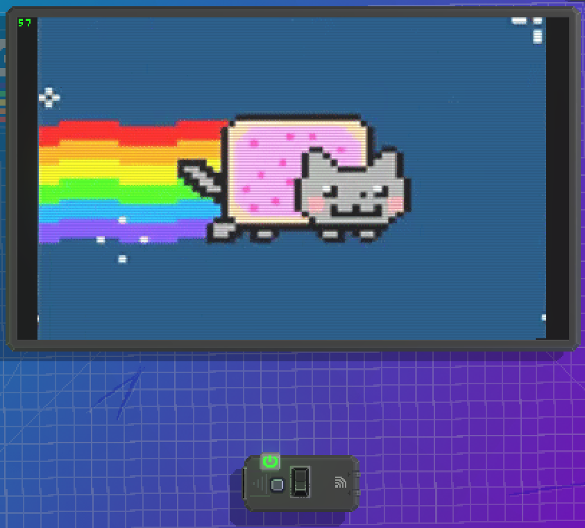

# Video player

This gadget allows the playback of a locally hosted `video.rgv` file which is a custom format that stores video data in a way that's easy to implement.

This gadget requires internet permissions to function properly.

This folder also provides the `convert.py` and `server.py` files to convert and host the video file.

The gadget contains a button to fetch a video and a switch to display the gadgets ticks per second.

Links:
- [Steam Workshop](https://steamcommunity.com/sharedfiles/filedetails/?id=2985434698)
- [base64.lua](https://github.com/iskolbin/lbase64)
- [Python](https://www.python.org/)
- [FFmpeg](https://ffmpeg.org/)

# How to use the converter and the server?

Requirements:
- Python 3.10 or newer
- PIP
- A video/gif to convert
- Basic command line knowledge
- FFmpeg

1. Install the requirements:
`pip install -r requirements.txt`
2. Put the video/gif you want to convert into the same folder where `convert.py` is located and make sure it's named `toconvert` otherwise the program won't see it.
3. Run `convert.py` and wait for it to finish (depending on the size of the video it might take a while)
4. After `convert.py` finishes, run `server.py`
5. Start the gadget in-game and it should start downloading and playing the video.

# RGVideo format
The header contains the following info in order:
- `RGVIDEO`
- Integer containing the width of the video
- Integer containing the amount of frames the video has
- Byte containing the video framerate
- Palette stored as 3 bytes containing the R, G and B colors.
- `VIDEDATA` Marking the beginning of the videodata

The video data is basically a long list of indexes pointing to a set color in the palette.